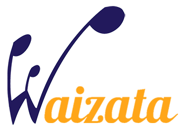
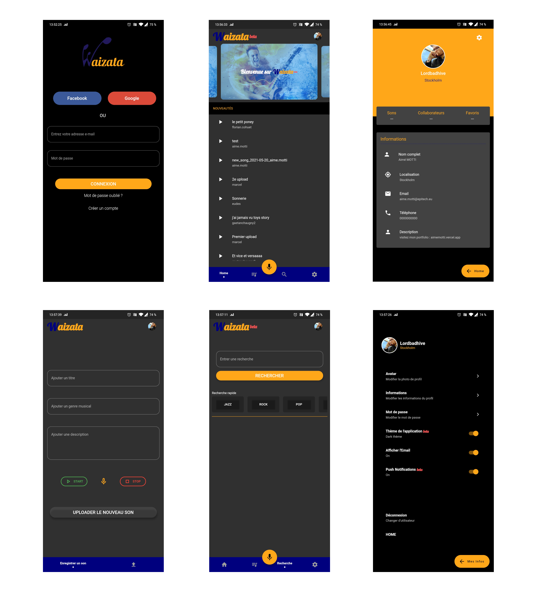

# 

## Présentation

Waizata est une plateforme de partage de compositions musicales collaboratives et veut se placer comme le réseau social de la musique.

Notre but : permettre un accès plus simple à la composition et à l'édition en collaboration, d'œuvres musicales. C'est une plateforme permettant de mettre en relation des mélomanes que ce soit leur hobby, ou leur métier.

Nous proposons à une personne d'enregistrer de diverses manières un morceau sur notre plateforme (piano virtuel, voix, logiciels musicaux), ensuite nous offrons le moyen, à cette même personne ou à un autre utilisateur, d'éditer ce morceau en le modifiant, en y ajoutant des éléments, etc.

Waizata cherche être accessible au plus grand nombre. Que l'utilisateur soit un novice en termes de musique ou un professionnel reconnu, nous souhaitons offrir une utilisation de notre plateforme la plus facile et instinctive possible afin d'aider la création d'œuvres musicales et leur reconnaissance.

Waizata est le projet de fin d'étude développé par 6 étudiants d'Epitech :
* **Développeur Mobile :**
  * [Aimé M.](https://aimemotti.vercel.app) - *Chef de projet*
* **Développeur Back-end :**
  * Pierre B.
  * Florian C.
  * Charles D.
  * Gaëtan C.
* **Développeur Front-end :**
  * Jason S.

## Site Web

[Accéder à notre site web](https://waizata.github.io)

## Application Mobile

[Télécharger l'application mobile](https://github.com/Waizata/Waizata.github.io/releases/download/v0.1.0-beta/waizata.apk)

Si besoin vous pouvez utiliser [l'aide à l'installation](https://waizata.github.io/help) pour l'application mobile

